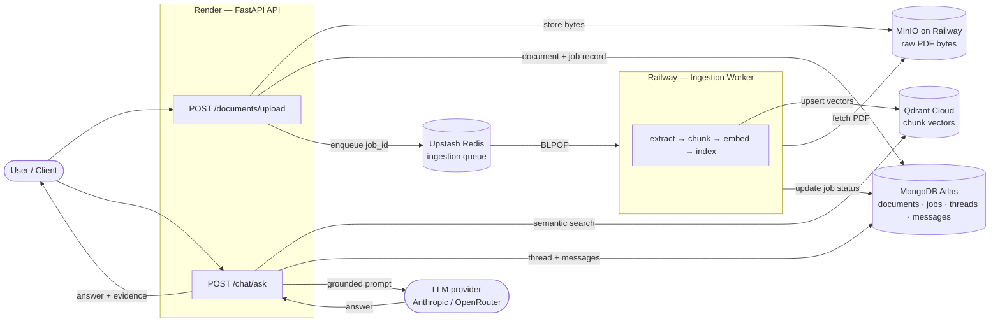
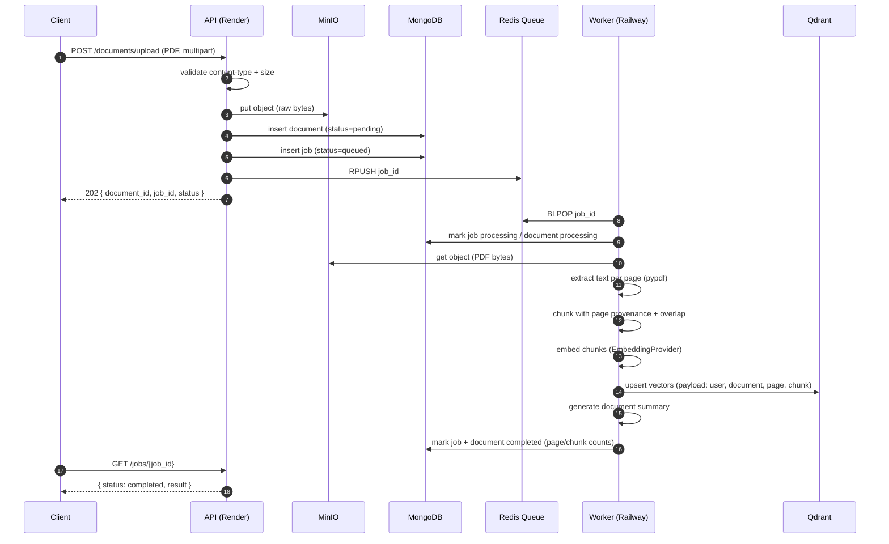
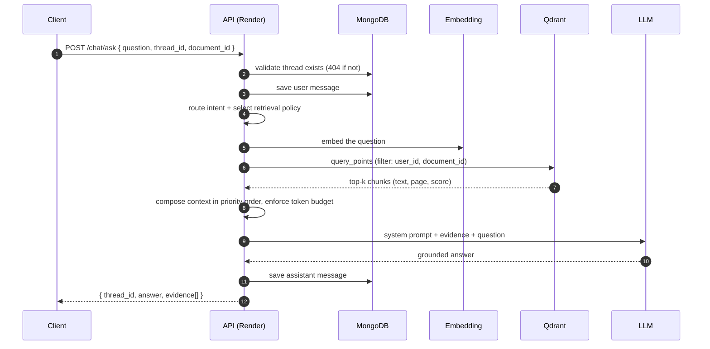

# Runner.ai

Runner.ai is a document-grounded question-answering service. A user uploads a
PDF, the system ingests it asynchronously, and afterwards the user can ask
natural-language questions and receive answers grounded in the specific
passages of that document, with the supporting evidence returned alongside the
answer.

The core problem it addresses is that large language models have no reliable
knowledge of a user's private documents. Two naive solutions both fail at
scale: fine-tuning per document is slow and expensive, and pasting an entire
document into the prompt is limited by the context window, is costly per token,
and degrades answer quality as irrelevant text crowds out the relevant
passages. Runner.ai instead uses retrieval: documents are split into chunks,
embedded into a vector space, and only the passages most relevant to a given
question are retrieved and placed into the prompt. The model sees a small,
focused, relevant context rather than an entire file.

Ingestion is deliberately asynchronous. Parsing, chunking, embedding, and
indexing a PDF is variable-latency work that can take seconds to minutes
depending on document size. Doing it inside the HTTP request would tie up a web
worker, risk client timeouts, and make the API fragile under load. Instead, the
upload endpoint does the minimum synchronous work — validate, persist the file,
record metadata, enqueue a job — and returns immediately with a `job_id`. A
separate worker process performs the heavy work and updates job state, which the
client polls. This is the standard separation between request-path latency and
background throughput.

Retrieval is used instead of prompt-stuffing for three concrete reasons: cost
(you pay per token, and sending only the relevant chunks is far cheaper than
sending the whole document on every question), quality (models answer more
accurately when the context is small and on-topic), and scale (a document can be
far larger than any context window, but its chunk index is bounded and
queryable). The retrieved chunks are also returned to the caller as evidence, so
every answer is inspectable and attributable rather than an opaque generation.

Runner.ai is built as a production service rather than a notebook prototype. It
runs as two independently deployed processes (an API and a worker) backed by
managed cloud infrastructure for document storage, the job queue, metadata, and
the vector index. It uses structured JSON logging with per-request correlation
IDs, a typed configuration layer, startup index management, and a containerized
build shared by both processes. The sections below document the architecture,
the request and ingestion flows, the technology choices and their trade-offs,
and the current boundaries of the system.

---

## Architecture

The system is two processes over shared managed infrastructure. The ingestion
path (write) and the query path (read) are decoupled by the job queue and the
vector index; they never call each other directly.



---

## Upload Flow

The upload request is intentionally cheap. It never parses or embeds the PDF; it
persists the bytes, records metadata, enqueues a job, and returns.



Bytes are stored before any records are created, so a failed upload never leaves
a job pointing at missing storage. The worker records failures on both the job
and the document, so a single malformed PDF marks that job failed and the worker
continues to the next one rather than crashing.

---

## Question / Answer Flow

A question is answered by retrieving the most relevant chunks for that document
and composing a bounded, grounded prompt. The evidence is returned so the answer
is attributable.



When a `document_id` is supplied, retrieval is scoped to that document. The
query embedding and the chunk embeddings are produced by the same provider, so
index-time and query-time vectors are consistent.

---

## Production Stack

**Backend**
- FastAPI (asynchronous) served by Uvicorn
- Pydantic for request/response schemas and typed settings
- `httpx` for outbound LLM calls

**Storage**
- MinIO (S3-compatible) for raw PDF bytes
- MongoDB (Motor async driver) for documents, jobs, threads, messages, summaries, preferences, and knowledge

**Queue**
- Redis list used as a FIFO ingestion job queue (`RPUSH` producer, `BLPOP` consumer)

**Vector database**
- Qdrant, cosine similarity, with payload indexes on the filtered fields (`user_id`, `document_id`, `thread_id`, `page`)

**AI**
- LLM access behind a provider-agnostic client supporting Anthropic and OpenRouter, with request timeout and retry, plus a no-network stub for local/offline runs
- Embeddings behind a pluggable `EmbeddingProvider` interface (see Design Decisions for the current provider)

**Deployment**
- Docker image shared by the API and the worker
- `docker-compose` for the full local stack

**Infrastructure**
- Render (API), Railway (worker and MinIO), MongoDB Atlas, Upstash (Redis), Qdrant Cloud

---

## Features

### Implemented

- Asynchronous PDF upload with immediate `job_id` response
- Redis-backed background ingestion queue
- Object storage of raw files in MinIO, decoupled from metadata
- PDF text extraction per page (pypdf)
- Character-based chunking with configurable size, overlap, and page provenance
- Vector embedding behind a pluggable provider interface
- Vector indexing and filtered semantic search in Qdrant
- Idempotent creation of Qdrant collection and payload indexes on startup
- Thread management (create, list, get, delete) with cascade cleanup
- Document-grounded question answering scoped by `document_id`
- Evidence (retrieved chunks with page and score) returned with each answer
- Server-Sent Events streaming variant of the chat endpoint
- Rolling per-thread conversation summaries generated by the LLM
- Long-term user preferences and a keyword-searchable knowledge store
- Priority-ordered context assembly with a token budget
- Job status tracking via a polling endpoint
- Interactive OpenAPI (Swagger) documentation
- Structured JSON logging with per-request correlation IDs
- Typed configuration via environment variables
- Containerized build and full local Compose stack

### Planned

- Replace the deterministic embedding provider with a hosted or local
  transformer embedding model (the interface is already in place)
- Reliable queue semantics for the worker (in-flight recovery, retries, dead-letter)
- Hybrid retrieval (keyword + vector) and a re-ranking stage
- Authentication and multi-tenancy (the system currently uses a single fixed user id)
- A web frontend

---

## API

Base path is the deployed API host. Interactive documentation is served at
`/docs` (Swagger UI) and the raw schema at `/openapi.json`.

### Threads
- `POST /threads` — create a conversation thread. Body `{ "title": "..." }`. Returns `{ id, user_id, title, created_at, updated_at }`.
- `GET /threads` — list threads (most recently updated first).
- `GET /threads/{thread_id}` — fetch one thread (`400` invalid id, `404` missing).
- `DELETE /threads/{thread_id}` — delete a thread and cascade its messages and summary.

### Documents
- `POST /documents/upload` — multipart PDF upload. Validates content type and size, stores the file, records the document and job, enqueues ingestion, and returns `202 { document_id, job_id, status }`.
- `GET /documents/{document_id}` — document status and, once ingested, its summary and page/chunk counts.

### Jobs
- `GET /jobs/{job_id}` — ingestion job status (`queued`, `processing`, `completed`, `failed`) and result metadata.

### Chat
- `POST /chat/ask` — body `{ question, thread_id, document_id? }`. Validates the thread, retrieves relevant chunks, composes a grounded prompt, calls the LLM, persists the exchange, and returns `{ thread_id, answer, evidence[] }`.
- `POST /chat/stream` — the same pipeline delivered as Server-Sent Events: status milestones, streamed answer tokens, then a final event with the answer and metadata.

### Memory
- `GET /memory/preferences` — list captured user preferences.
- `GET /memory/knowledge` — list knowledge entries.
- `POST /memory/knowledge` — add a knowledge fact.

### Health
- `GET /health` — liveness plus MongoDB connectivity.
- `GET /` — service banner and version.

---

## Design Decisions

**Why a Redis queue.** Ingestion is slow and bursty; the API must stay fast and
predictable. A queue decouples the request rate from the processing rate, lets
the worker pull work at its own pace, and allows the two tiers to scale
independently. A Redis list with `RPUSH`/`BLPOP` is the smallest thing that
provides durable, ordered, blocking hand-off without adding a heavier broker.
The trade-off is that a plain list gives at-most-once delivery (see the
talking-points section) rather than the acknowledgement semantics of a
purpose-built queue; that is a deliberate, documented boundary for this version.

**Why MinIO / object storage.** PDFs are large binary blobs. Object storage is
built for exactly this: cheap, durable, content-addressable byte storage that
streams. Keeping files in MinIO keeps them out of the database and out of the
request/response path, and gives ingestion a stable place to fetch the original
bytes from.

**Why not store PDFs in MongoDB.** A document database is optimized for queryable
structured records, not multi-megabyte binaries. Storing large files inline
bloats documents, strains the working set and backups, and pushes against
document-size limits. The correct pattern is to store the bytes in object
storage and keep only a reference plus metadata in the database.

**Why Mongo stores metadata.** Documents, jobs, threads, messages, and summaries
are flexible, evolving records that are queried by id and by user. A document
store fits this shape well, avoids rigid migrations while the schema is still
moving, and the async driver integrates cleanly with the FastAPI event loop.
Startup index creation keeps the hot lookups fast as data grows.

**Why object storage is kept separate from metadata.** Separating bytes
(MinIO) from records (Mongo) lets each be sized, scaled, and backed up
according to its own access pattern, and it means the upload endpoint can
persist the file and record metadata as two explicit, ordered steps —
bytes first, so a record never references missing storage.

**Why Qdrant.** Semantic search requires an index built for high-dimensional
vector similarity with metadata filtering, which a general-purpose database does
not provide efficiently. Qdrant gives approximate nearest-neighbour search with
payload filters, so a query can be scoped to a specific user and document while
still ranking by similarity. Payload indexes on the filtered fields are required
for those filters and are created idempotently at startup.

**Why asynchronous workers.** Separating the web tier from the processing tier
is what keeps the API responsive under load and lets ingestion throughput scale
horizontally by simply running more worker processes against the same queue. It
also isolates failure: a worker crash or a bad document does not affect the API's
ability to accept uploads and answer questions about already-ingested documents.

**Why evidence is returned.** Grounding is only useful if it is verifiable.
Returning the retrieved chunks (with page numbers and similarity scores)
alongside the answer makes every response inspectable and attributable, turns
"the model said so" into "here is the passage it used," and makes retrieval
quality debuggable in production.

**Why threads exist.** Questions are part of a conversation, not isolated
one-offs. Threads give each conversation a stable identity so messages can be
persisted and ordered, follow-up questions have history, and rolling summaries
can compress older turns. They are also the unit the chat endpoints validate
against, which keeps message storage well-formed.

---

## Deployment

The system runs as two processes over managed cloud services. Nothing is
self-hosted beyond the two application processes.

- **Render — API.** Runs the FastAPI app under Uvicorn. Stateless and
  horizontally scalable; holds no local state. Exposes the public HTTP surface
  and Swagger docs.
- **Railway — Worker.** Runs `python -m app.worker` from the same image. Consumes
  the Redis queue and performs ingestion. Stateless; multiple instances can run
  against the same queue.
- **Railway — MinIO.** S3-compatible object storage for uploaded PDFs.
- **MongoDB Atlas.** Managed MongoDB for documents, jobs, threads, messages,
  summaries, preferences, and knowledge.
- **Upstash — Redis.** Managed Redis backing the ingestion job queue.
- **Qdrant Cloud.** Managed vector database for chunk embeddings and search.

The API and worker share one container image and one configuration surface; they
differ only in the command they run. Service hostnames and credentials are
supplied entirely through environment variables, so the same image runs locally
and in each cloud environment without modification.

---

## Running Locally

Prerequisites: Docker and Docker Compose (and Python 3.11+ if running the
processes directly).

The full stack — MongoDB, Redis, Qdrant, MinIO, the API, and the worker — is
defined in `docker-compose.yml`:

```bash
cp .env.example .env          # set an LLM key for real answers; otherwise a stub is used
docker compose up --build
```

The API is then available at `http://localhost:8000` with docs at `/docs`.

To run the application processes directly against the infrastructure containers:

```bash
docker compose up -d mongodb redis qdrant minio

cd backend
python -m venv .venv && source .venv/bin/activate
pip install -r requirements.txt

uvicorn app.main:app --reload     # terminal 1 — API
python -m app.worker              # terminal 2 — ingestion worker
```

Configuration is read from environment variables (see `.env.example` for the
full list). The most relevant groups are:

- `MONGO_URL`, `DB_NAME`
- `REDIS_URL`, `JOB_QUEUE_NAME`
- `QDRANT_URL`, `QDRANT_API_KEY`, `QDRANT_COLLECTION`
- `MINIO_ENDPOINT`, `MINIO_ACCESS_KEY`, `MINIO_SECRET_KEY`, `MINIO_BUCKET`, `MINIO_SECURE`
- `LLM_PROVIDER`, `LLM_MODEL`, `ANTHROPIC_API_KEY` / `OPENROUTER_API_KEY`
- `EMBEDDING_DIM`, `CHUNK_SIZE`, `CHUNK_OVERLAP`, `MAX_UPLOAD_BYTES`, `CONTEXT_CHARS_PER_TOKEN`
- `LOG_LEVEL`, `CORS_ORIGINS`

Only `MONGO_URL` is strictly required; the rest have working defaults that match
the Compose stack.

---

## Project Structure

```
backend/
  Dockerfile                 # shared image for the API and the worker
  requirements.txt
  app/
    main.py                  # app bootstrap: lifespan, CORS, request-id middleware, routers
    config.py                # typed settings loaded from environment
    database.py              # Mongo client, collections, startup index creation
    logging_config.py        # structured JSON logging + request-id context
    worker.py                # ingestion worker entrypoint (Redis consumer loop)
    routes/                  # HTTP layer: health, threads, documents, jobs, chat, memory
    schemas/                 # Pydantic request/response and internal contracts
    services/                # business logic:
                             #   thread / message / document / job services
                             #   storage (MinIO), vector_store (Qdrant), embedding
                             #   pdf extraction, chunking, ingestion orchestration
                             #   behavior_router, context_policy, memory_retrieval,
                             #   context_composer, llm_provider / llm_client
                             #   thread_summary, preference, knowledge, job_queue
docker-compose.yml           # full local stack (infrastructure + API + worker)
```

The layering is deliberate: routes handle HTTP and validation, services hold all
business logic, and schemas define the contracts between them. The worker reuses
the same service layer as the API, so ingestion and retrieval share one
implementation rather than diverging.

---

## Future Roadmap

The following capabilities are design targets for a subsequent version. **They
are not implemented in the current system** and are listed here to make the
system's boundaries explicit.

- **Planner.** Decompose a user goal into a structured, multi-step plan rather
  than following a single fixed retrieval-and-answer pipeline.
- **Executor.** Execute a plan's steps deterministically against a set of tools,
  passing outputs between steps.
- **Autonomous agents.** Multi-step, self-correcting task execution rather than
  single-turn question answering.
- **Tool registry.** A catalogue of callable capabilities (internal services,
  external APIs) with typed metadata, so a planner can select among them.
- **Dynamic context engine.** Capability-aware retrieval that selects tools and
  context per request instead of a static per-intent policy.
- **Memory evolution.** Automatic extraction and consolidation of long-term
  memory from conversations, beyond the current explicit preference and
  knowledge stores.

---

## Resume Highlights

- Designed and deployed a document-grounded question-answering service as two
  independently scalable processes (API and background worker) over managed
  cloud infrastructure.
- Built an asynchronous ingestion pipeline (validate, store, enqueue, process)
  that keeps the upload request fast and moves parsing, chunking, embedding, and
  indexing to a Redis-driven worker.
- Implemented a retrieval-augmented answering path that scopes semantic search to
  a specific document and returns the supporting passages as evidence with every
  answer.
- Integrated Qdrant for filtered vector search and made collection and payload
  index creation idempotent on startup so deployment requires no manual vector
  database configuration.
- Separated object storage (MinIO) from metadata (MongoDB), storing raw PDFs in
  S3-compatible storage and keeping only references and records in the database.
- Wrapped LLM access behind a provider-agnostic client (Anthropic / OpenRouter)
  with request timeouts, retries, and an offline stub for local development.
- Added structured JSON logging with per-request correlation IDs propagated
  across the API for end-to-end traceability.
- Containerized the system with a single image shared by the API and the worker,
  plus a full local Docker Compose stack mirroring production.
- Modeled conversations as threads with persisted messages, LLM-generated rolling
  summaries, and a token-budgeted context assembly step.
- Deployed across Render, Railway, MongoDB Atlas, Upstash, and Qdrant Cloud with
  configuration driven entirely by environment variables.

---

## Interview Talking Points

A summary of the questions this design tends to raise, and how the current
system answers them. Where the current implementation makes a trade-off rather
than a guarantee, that is stated plainly.

**Why a queue?** To decouple request latency from processing throughput.
Ingestion is slow and bursty; if it ran inside the HTTP request the API would
block, time out, and be unable to absorb spikes. A queue lets the API accept
work instantly and lets workers drain it at their own rate, and it lets the two
tiers scale independently.

**Why MinIO / object storage?** PDFs are large binaries. Object storage is
purpose-built for durable, cheap, streamable byte storage, whereas a database
is built for queryable records. Keeping files in object storage also keeps them
off the request path and out of the database working set.

**Why not store PDFs in Mongo?** Large binaries inflate documents, strain
backups and memory, and approach document-size limits. The established pattern is
bytes in object storage, references and metadata in the database.

**Why Qdrant?** Semantic search needs approximate nearest-neighbour over
high-dimensional vectors with metadata filtering. A general-purpose database
cannot do this efficiently. Qdrant provides similarity search plus payload
filters, so a query can be constrained to one user and one document while still
ranking by relevance.

**Why background workers?** To isolate slow, failure-prone work from the API.
Workers can crash, retry, or be scaled out without affecting the API's ability to
accept uploads and answer questions. It also gives a clean place to concentrate
the CPU- and IO-heavy pipeline.

**How would you scale it?** The API and worker are stateless, so both scale
horizontally: run more API instances behind the load balancer, and more worker
instances against the same queue. The stateful tiers are managed services
(Mongo, Redis, Qdrant, MinIO) that scale on their own. The next bottlenecks to
address would be embedding throughput (batching, a dedicated embedding service)
and retrieval latency under large indexes (Qdrant sharding and quantization).

**What happens if a worker crashes?** In the current design the queue uses
`BLPOP`, which removes a job id from the list at the moment it is claimed. If a
worker crashes after claiming a job but before finishing, that job is not
automatically requeued, so the document remains in its last recorded state in
Mongo (which is the authoritative record). This is at-most-once delivery — a
deliberate simplification for this version. The reliable-queue upgrade
(in-flight tracking with a visibility timeout, or a stream/consumer-group with
acknowledgements, plus a dead-letter path) is the first item on the ingestion
roadmap.

**How do retries work?** Two different layers behave differently, and this is
worth stating precisely. LLM calls retry transient failures with exponential
backoff inside the LLM client. Ingestion jobs, by contrast, do not currently
auto-retry: a failing job is caught, recorded as `failed` on both the job and the
document, and the worker moves on, so one bad PDF never stalls the queue.
Automatic ingestion retries and a dead-letter queue are planned, not yet
implemented.

**Why object storage (again, framed as a trade-off)?** The alternative — storing
files in the database — is simpler to reason about because there is one system
instead of two, and it keeps the file and its metadata transactionally together.
The cost is that it does not scale: binaries bloat the database and there is no
transactional guarantee across MinIO and Mongo, so the upload path is ordered
deliberately (write bytes first, then records) to make the failure modes
recoverable. For document workloads the storage-plus-reference pattern is the
right trade.

---

## Screenshots

Placeholders for the deployed system. Replace with images when publishing.

- **Architecture** — the rendered architecture diagram (`docs/screenshots/architecture.png`)
- **Swagger** — the interactive API docs at `/docs` (`docs/screenshots/swagger.png`)
- **Upload** — a successful `POST /documents/upload` response with `job_id` (`docs/screenshots/upload.png`)
- **Worker logs** — structured ingestion logs from job start to completion (`docs/screenshots/worker-logs.png`)
- **Job completed** — `GET /jobs/{job_id}` showing `completed` with page/chunk counts (`docs/screenshots/job-completed.png`)
- **Document Q&A** — a `POST /chat/ask` response with an answer and its evidence (`docs/screenshots/document-qa.png`)
