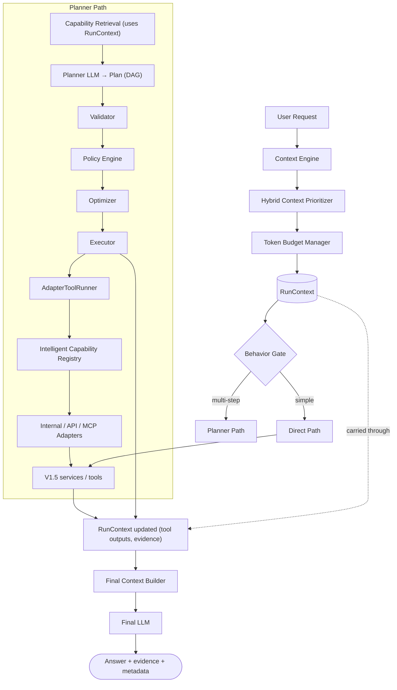

# Runner.ai V2 — Agent Architecture & Compatibility Report

Status: **living architecture document** for the V2 autonomous execution layer
(`backend/app/agent/`). Documentation only — this file describes the locked V2
architecture, maps it onto the Phase 1–9 code that already exists on this
branch, and defines the next implementation phases. It supersedes and extends
`docs/architecture/v2.md` (the frozen pre-implementation freeze); where the two
differ, this file is authoritative.

No runtime logic is introduced by this document. V1.5 services are not modified.

---

## 1. Current Phase 1–9 implementation summary

All of the following exist under `backend/app/agent/` and are covered by tests
in `backend/tests/agent/`. Each is deterministic, side-effect-free unless noted,
and imports only from `app.agent.*` (never from `app.services.*` yet — the
adapters that will bridge to V1.5 are still fakes).

| Phase | Module(s) | What exists |
|---|---|---|
| 1 | `models/tool_spec.py`, `registry/registry.py`, `registry/loader.py`, `tools/internal/specs.py` | `ToolSpec` metadata model + enums (`ToolKind`, `RiskLevel`, `SideEffectType`, `LatencyClass`); `ToolRegistry` (register/get/exists/list/filter, deterministic); `get_default_tool_registry()`; 10 **metadata-only** internal specs mapping V1.5 capabilities |
| 2 | `capabilities/models.py`, `scoring.py`, `retriever.py`, `keyword_retriever.py` | `CapabilityRetrievalRequest/Match/Response`; deterministic weighted keyword scoring; `CapabilityRetriever` ABC; `KeywordCapabilityRetriever` with filters + evidence-priority fallback |
| 3 | `models/plan.py` | `PlanStepType`, `FinalResponseMode`, `ArgBinding`, `PlanStep`, `Plan` (DAG validation, cycle detection, helpers `get_step`/`dependency_graph`/`root_steps`/`terminal_steps`) |
| 4 | `models/validation.py`, `validation/structural_validator.py` | `ValidationSeverity/Issue/Report`; `StructuralPlanValidator` (capability existence, enabled, arg schema, dependency + binding checks) |
| 5 | `models/policy.py`, `policy/engine.py` | `PolicyDecision`, `PolicyReasonCode`, `StepPolicyDecision`, `PolicyReport`; `PolicyEngine` (ALLOW / REQUIRE_APPROVAL / BLOCK, most-restrictive-wins) |
| 6 | `models/optimization.py`, `optimization/optimizer.py` | `OptimizationType/Note`, `ExecutionGroup`, `OptimizedPlan`, `OptimizationReport`; `PlanOptimizer` (DAG-level execution groups, duplicate detection, policy annotations) |
| 7 | `models/execution.py`, `execution/state.py`, `execution/runner.py`, `execution/executor.py` | `StepStatus`, `StepExecutionResult`; `ExecutionState` blackboard; `ToolRunner` ABC + `FakeToolRunner`; `PlanExecutor` (sequential group execution, binding resolution, policy-aware skip/block/await) |
| 8 | `tools/adapter.py`, `tools/adapter_registry.py` | `ToolAdapter` ABC (`execute(tool, args) -> dict`); `AdapterRegistry` (register/get/exists/list_kinds by `ToolKind`) |
| 9 | `execution/adapter_runner.py` | `AdapterToolRunner` (a `ToolRunner` that dispatches `ToolRegistry → ToolSpec → AdapterRegistry → adapter → output`) |

**What is deliberately NOT present yet:** any LLM call in the agent layer, any
real adapter that touches V1.5 services, the Context Engine, the Behavior Gate,
`RunContext`, the Token Budget Manager, the orchestrator, and the `/agent/run`
endpoint.

---

## 2. Locked V2 architecture



Both paths write into the **same `RunContext`**, and both terminate at the
**Final Context Builder → Final LLM**. `RunContext` is created before the
Behavior Gate and is never discarded.

---

## 3. Runtime principles

1. **The LLM plans and writes prose; it never executes tools.** Planning and
   final answering are the only two LLM calls in the base pipeline (a reranker /
   judge is a future, optional third).
2. **Deterministic-first.** Every decision that can be made by rules is made by
   rules (behavior gating, context prioritization tier 1, validation, policy,
   optimization, execution scheduling). Semantic / LLM judgment is layered on
   top, never underneath.
3. **A plan is a DAG**, not a list — this is what makes the Optimizer and
   Executor able to parallelize and schedule.
4. **Context is first-class and durable.** Working context is assembled up
   front and travels through the whole run inside `RunContext`; it must never
   disappear after planning.
5. **Working context vs external retrieval are different things.** Recent
   messages, thread summary, pinned preferences, user knowledge, and active
   execution state are *always-loaded working context*. Document chunks, email,
   calendar, invoices are *external retrieval* — fetched on demand by
   capabilities, not preloaded.
6. **One-way dependency.** `app.agent.*` may import `app.services.*`;
   `app.services.*` must never import `app.agent.*`. The agent layer stays
   deletable and V1.5 stays intact.
7. **Fast path is a feature.** Simple operations bypass the planner to preserve
   latency and cost.
8. **Everything is observable.** Each run has stable ids and a durable
   `RunContext` that doubles as the audit record.

---

## 4. Runtime invariants

- `RunContext` exists from just after the Context Engine until the final
  response; no stage may drop or replace it (stages append/annotate).
- The Token Budget Manager is the **only** component that decides what text
  enters the planner prompt and the final-answer prompt.
- Capability Retrieval consumes `RunContext`, not the raw question alone.
- The Executor is the **only** component that invokes tools; the LLM output is
  always a `Plan`, never a side effect.
- A `BLOCK` policy decision means the step is recorded and never executed; a
  `REQUIRE_APPROVAL` decision means the step is recorded as awaiting approval and
  never executed until approval exists (HITL enforcement is a later phase).
- The Optimizer never changes plan semantics (no step removal, no arg rewrite,
  no dependency change) — only scheduling and annotation.
- Direct path and planner path produce the same `RunContext` shape so the Final
  Context Builder is path-agnostic.

---

## 5. End-to-end workflow

1. **Context Engine** assembles working context for `(user_id, thread_id)`.
2. **Hybrid Context Prioritizer** ranks working-context items (deterministic →
   semantic → future reranker).
3. **Token Budget Manager** selects the subset that fits the planner budget.
4. **`RunContext`** is created holding request + working + prioritized context.
5. **Behavior Gate** reads `RunContext` and chooses direct vs planner.
6a. **Direct path**: resolve the single capability, execute it (via the same
    adapter layer), write outputs/evidence into `RunContext`.
6b. **Planner path**: Capability Retrieval (RunContext-aware) → Planner LLM →
    Validator → Policy → Optimizer → Executor (via AdapterToolRunner → adapters
    → V1.5 services), writing each artifact into `RunContext`.
7. **Final Context Builder** assembles the final-answer prompt from prioritized
   working context + tool outputs (as evidence), within the answer budget.
8. **Final LLM** produces the grounded answer; response + evidence + metadata
   are returned and recorded on `RunContext`.

---

## 6. Context Engine design

**Purpose.** Produce the *working context* — the always-relevant, user-scoped
state that any request may need — independent of the specific question.

**Location (planned).** `app/agent/context/engine.py`.

**Inputs.** `user_id`, `thread_id`, the raw request, and a handle to the active
`ExecutionState`/`RunContext` (for follow-up turns).

**Assembles (working context):**
- recent messages — reuse `app.services.message_service.get_recent_messages`
- thread summary — reuse `app.services.thread_summary_service.get_thread_summary`
- pinned / recent user preferences — reuse `app.services.preference_service.get_preferences`
- user knowledge — reuse `app.services.knowledge_service` (list/search)
- active execution state — from a prior/ongoing `RunContext`

**Explicitly does NOT load:** document chunks, email, calendar, invoices, or
other corpora. Those are *external retrieval* surfaced through capabilities /
tools during execution, and are pulled only when a step needs them. This keeps
the working context small, cheap, and bounded.

**Output.** A list of `ContextItem`s (proposed model), each with `source`,
`content`, `provenance` (ids/seq), and raw deterministic signals (recency,
role, pinned flag). It reuses the *intent* of V1.5's `ContextEvidence` but is an
agent-layer model so the agent package stays self-contained.

**Reuse note.** V1.5 already has these retrieval functions; the Context Engine
is an orchestration layer over them, not a reimplementation.

---

## 7. Hybrid Context Prioritizer design

**Purpose.** Order working-context items by usefulness, using a tiered strategy
so the cheap deterministic signal dominates and expensive judgment is optional.

**Location (planned).** `app/agent/context/prioritizer.py`.

**Tiers (in order of authority):**
1. **Deterministic signals (implemented-first).** Recency, message role,
   pinned/explicitly-referenced items, source-type weight (reuse the
   `evidence_priority` / `context_weight` fields already on `ToolSpec`, and the
   priority concept from V1.5 `ContextPolicy`). This tier alone produces a valid
   ordering.
2. **Semantic similarity (next).** Embed the request and each item; blend the
   similarity score with the deterministic score (e.g. weighted sum or
   tie-break). Reuse `app.services.embedding_service`.
3. **Reranker / LLM judge (future — documented only, not implemented now).** A
   cross-encoder or LLM scores the top-N candidates for final ordering.

**Output.** Prioritized `ContextItem`s carrying `score`, the contributing
signals, and a short reason (for observability), mirroring how
`CapabilityMatch` already records `matched_fields` / `reason`.

**Production pipeline (locked).** Context priority is *not* deterministic-only.
The full production design is a hybrid, multi-tier pipeline:

```
context candidates
  → deterministic filtering / scoring   (tier 1 — implemented)
  → semantic similarity                 (tier 2 — planned)
  → reranker / cross-encoder            (tier 3 — planned)
  → token budget                        (§8)
  → planner / final context view
```

The current code implements **only tier 1** (deterministic). Tiers 2 and 3 are
locked *production* tiers, not optional nice-to-haves — the architecture must
show them even while the code ships deterministic-first. See §26.1.

**Principle.** Deterministic first, semantic second, reranker last — never
invert the order.

---

## 8. Token Budget Manager design

**Purpose.** Decide precisely what text enters each LLM prompt. It is the single
authority over prompt composition size.

**Location (planned).** `app/agent/context/budget.py`.

**Two budgets:**
- **Planner budget** — prioritized working context + retrieved capabilities that
  fit into the Planner LLM prompt.
- **Final-answer budget** — prioritized working context + tool outputs
  (evidence) that fit into the Final LLM prompt.

**Mechanism.** Reuse V1.5's proven approach in
`app.services.context_composer` (`_apply_token_budget`, chars-per-token
estimate via `settings.context_chars_per_token`): keep items in priority order
until the budget is spent, truncate the boundary item, drop the remainder, and
record what was dropped. The agent-layer manager wraps that logic and reports a
`BudgetReport` (kept / dropped / truncated) onto `RunContext`.

**Why separate from the Prioritizer.** Prioritization decides *order*; budgeting
decides *cut-off*. Keeping them separate lets the same ordering feed two
different budgets (planner vs final) without recomputation.

---

## 9. RunContext design

**Purpose.** The spine of a run. Created after context assembly, carried through
every stage, and never discarded. It is both the working state and the audit
record.

**Location (planned).** `app/agent/models/run_context.py` (+ a small
`app/agent/context/run_context.py` for mutation helpers if needed).

**Fields (proposed):**
- **Identity:** `run_id`, `trace_id`, `user_id`, `thread_id`
- **Request:** raw question, `document_id`, and request options
- **Working context:** the Context Engine output
- **Prioritized context:** the Prioritizer output + `BudgetReport`s
- **Behavior profile:** direct vs planner + the reasons (from the Behavior Gate)
- **Selected capabilities:** the Capability Retrieval result (planner path)
- **Plan:** the `Plan` (Phase 3)
- **Validation report:** `ValidationReport` (Phase 4)
- **Policy report:** `PolicyReport` (Phase 5)
- **Optimized plan:** `OptimizedPlan` (Phase 6)
- **Execution state:** the Phase 7 `ExecutionState` (composed, not replaced)
- **Evidence:** normalized tool outputs used for the final answer
- **Final response metadata:** provider/model, token usage, timings

**Relationship to `ExecutionState` (Phase 7).** `RunContext` *composes*
`ExecutionState` (holds it as a field). Phase 7 stays untouched; `ExecutionState`
remains the per-step result store, and `RunContext` is the superset that also
holds context, plan, and policy artifacts.

**Mutability.** Append/annotate only; earlier artifacts are never overwritten,
which is what makes the run auditable and (later) resumable.

---

## 10. Behavior Gate design

**Purpose.** Decide **direct path vs planner path** using `RunContext`.

**Location (planned).** `app/agent/gate/behavior_gate.py`.

**Position.** After the Context Engine (so it can use working context), before
the path split.

**Strategy (deterministic-first).** Reuse V1.5's `behavior_router` heuristics
plus signals from `RunContext`:
- Simple, single-capability requests → **direct**: document Q&A, job status,
  preference update, simple memory question.
- Multi-step goals, actions with side effects, external-tool needs, or genuinely
  ambiguous requests → **planner**.
- (Future) a small LLM classifier only when the deterministic gate is
  low-confidence — never the planner itself.

**Output.** A `behavior_profile` written onto `RunContext` (chosen path + reason
+ confidence), so the decision is inspectable.

**Why after context, not before.** The gate benefits from knowing what working
context exists (e.g. an active plan, a referenced document) — context is cheap
and shared by both paths, so it is assembled first.

---

## 11. Direct path vs planner path

**Direct path** (latency- and cost-preserving):
- For the four simple operations. Each maps to a single capability executed
  through the **same adapter layer** the planner path uses (so there is one
  execution mechanism, not two).
  - document Q&A → the V1.5 composite `answer_from_context` (wraps
    `chat_service.handle_chat`)
  - job status → `get_job_status` (wraps `job_service.get_job`)
  - preference update → `save_user_preference` (wraps `preference_service.save_preference`)
  - simple memory question → `get_thread_summary` / `get_recent_messages` / knowledge
- No planner, validator, or optimizer. The result is written to `RunContext`,
  then the Final Context Builder + Final LLM produce the answer (for Q&A the
  composite already answers; the builder can pass it through).

**Planner path** (for multi-step goals):
- Capability Retrieval → Planner LLM → Validator → Policy → Optimizer → Executor,
  exactly the Phase 1–9 pipeline, all writing into `RunContext`.

Both paths converge on the Final Context Builder, guaranteeing a uniform
response contract.

---

## 12. Capability Registry evolution (Intelligent Capability Registry)

The existing `ToolRegistry` (Phase 1) remains the single source of truth and is
**not replaced**; it *evolves* by adding two projections and (later) retrieval
intelligence. **There is no separate Capability Binder.**

- **Planner view.** A projection of each `ToolSpec` containing only what the
  Planner LLM needs: `name`, `description`, `input_schema`, `examples`,
  `typical_user_questions`, `capability_tags`. Keeps the planner prompt small and
  hallucination-resistant.
- **Executor view.** A projection containing only dispatch metadata: `kind`,
  `handler_ref`, `timeout_seconds`, `max_retries`, `idempotent`, `side_effects`.
  Consumed by `AdapterToolRunner`.
- **Retrieval intelligence (later).** Capability embeddings stored in a dedicated
  Qdrant collection (reusing `embedding_service` + `vector_store_service`
  patterns) to move capability retrieval from keyword → hybrid.

These are additive methods/adapters over the existing registry; the Phase 1 API
(`register`/`get`/`list_*`/`filter_*`) is unchanged.

---

## 13. Capability Retrieval using RunContext

**Change from Phase 2.** `CapabilityRetrievalRequest.query` is a raw string
today. In V2, capability retrieval must be driven by `RunContext`, not the bare
question — it should use the request plus prioritized working-context signals
(e.g. an actively referenced `document_id`, recent intents, an in-flight plan).

**Approach (additive, non-breaking).** Add a `RunContext → CapabilityRetrievalRequest`
builder rather than changing the Phase 2 model. The builder composes a richer
query and sets filters (`allowed_kinds`, `allowed_risk_levels`, `required_tags`,
`excluded_tool_ids`) from `RunContext`. `KeywordCapabilityRetriever` continues to
work unchanged; the embedding/hybrid retrievers slot in behind the same
`CapabilityRetriever` interface.

**Production pipeline (locked).** Capability retrieval is hybrid and
RunContext-driven, mirroring context retrieval (§7):

```
capability registry
  → deterministic filters               (kind / risk / tags / exclusions — implemented)
  → semantic capability retrieval        (embed RunContext vs capability specs — planned)
  → capability reranker                  (cross-encoder over top candidates — planned)
  → top-k capability view
```

The input is the **`RunContext`**, never the raw request alone. The current code
implements the deterministic filter tier plus a RunContext-aware query builder;
the semantic and reranker tiers slot in behind the same `CapabilityRetriever`
interface.

**Invariant.** Neither the Planner nor the Direct Runtime ever sees the full
registry — both consume only the **top-k capability view**. This bounds prompt
size, cost, and blast radius, and keeps capability selection a first-class
retrieval problem. See §26.2.

**Output.** Top-K capabilities recorded on `RunContext.selected_capabilities`,
rendered to the planner as the **planner view** (§12).

---

## 14. Planner Engine

**Status:** not yet implemented (Phase 3 provides only the `Plan` output model).

**Location (planned).** `app/agent/planner/planner.py` (+ `prompt.py`).

**Input.** System prompt (decompose into a DAG using only the provided
capabilities; do not answer; output must match schema) + budgeted prioritized
context + the retrieved capabilities (planner view).

**Output.** A `Plan` (Phase 3) via schema-guided decoding, produced by reusing
the V1.5 `llm_client.complete`. The planner never executes anything.

**Loop (later).** On `ValidationReport.has_errors`, feed the issues back for a
bounded number of replans before failing the run.

---

## 15. Validator

**Status:** implemented (Phase 4), unchanged. `StructuralPlanValidator.validate(plan)`
→ `ValidationReport`. It answers "is the plan well-formed and executable against
the registry?" (capability existence, enabled, arg schema, dependency + binding
integrity). Runs after the planner, before policy. Collects all issues; never
fails fast; mutates nothing.

---

## 16. Policy Engine

**Status:** implemented (Phase 5), unchanged. `PolicyEngine(registry,
user_permissions).evaluate(plan)` → `PolicyReport` with per-step
`ALLOW`/`REQUIRE_APPROVAL`/`BLOCK` and reason codes, most-restrictive-wins.
Answers "should this be allowed here, and does it need approval?" — distinct
from the Validator. Annotation only; HITL enforcement lives later in the
Executor.

---

## 17. Optimizer

**Status:** implemented (Phase 6), unchanged. `PlanOptimizer.optimize(plan,
policy_report)` → `(OptimizedPlan, OptimizationReport)`. Builds DAG-level
execution groups (parallel where independent), detects duplicate tool calls
(annotation only), and preserves/annotates blocked and approval steps. Never
rewrites plan semantics.

---

## 18. Executor

**Status:** implemented (Phase 7), unchanged in contract. `PlanExecutor(tool_runner).execute(optimized_plan,
policy_report)` → `ExecutionState`. Runs execution groups in order (sequential
within a group for now), resolves `${step.output.field}` bindings from state,
skips dependents of failed/blocked/awaiting steps, and records every result.

**V2 integration (additive).** In the full pipeline the Executor is driven by
`AdapterToolRunner` (Phase 9) instead of `FakeToolRunner`, and its
`ExecutionState` is the one composed inside `RunContext`. No change to the
Executor's own logic is required for the base wiring; parallel execution,
retries, timeouts, and HITL pause/resume are later enhancements.

---

## 19. Adapter layer

**Status:** interfaces implemented (Phases 8–9); real adapters not yet written.

- `ToolAdapter` (Phase 8): `execute(tool, args) -> dict`, one per `ToolKind`.
- `AdapterRegistry` (Phase 8): maps `ToolKind → ToolAdapter`.
- `AdapterToolRunner` (Phase 9): `ToolRunner` that resolves `ToolSpec` from the
  registry and dispatches to the adapter for `tool.kind`.

**What must be added:** the **real internal adapter** that implements
`ToolAdapter` by calling the V1.5 service behind each internal `ToolSpec`
(`handler_ref` already records the intended target, e.g.
`app.agent.tools.internal.documents:search_documents`). This is the first point
where the agent layer touches live V1.5 code — a thin translation of typed args
to an existing service call, with zero duplicated business logic. API and MCP
adapters follow later.

**Phase 13+ update (Execution Bridge — additive, does not change locked
decisions).** The *live runtime* path (`DirectRuntime` / `PlannerRuntime`) does
not use the Phase 8–9 sync `ToolAdapter.execute -> dict` + `AdapterRegistry`
dispatch (that remains the `PlanExecutor`'s path). Instead it uses an **async
Execution Bridge** contract — `CapabilityExecutor.execute(tool, args) ->
AdapterResult` (`tools/result.py`) — whose default implementation
(`InternalCapabilityExecutor`) routes internal `ToolSpec`s to
`InternalAdapter`s. `AdapterResult` is the uniform success/evidence/retryable
shape the Recovery Pipeline (§20) and Final Context Builder consume.

**Phase 39 update (MCP adapter boundary).** MCP joins at this same
`CapabilityExecutor` seam, not as a second runtime. `app/agent/mcp/` discovers a
server's tools through an SDK-agnostic `MCPClient` Protocol and normalizes each
into a `ToolSpec` (`kind=MCP`, id `mcp.<server_id>.<tool_name>`) registered in
the *shared* `ToolRegistry`, so MCP tools participate in the **existing** hybrid
capability retrieval (§13, §26.2) with no separate path. A
`CompositeCapabilityExecutor` routes by `ToolKind` (internal → internal executor,
MCP → `MCPAdapter`); the `MCPAdapter` calls the client and normalizes the result
into `AdapterResult`. The planner/orchestrator/evaluator/repair/final-builder
stay MCP-agnostic; no vendor MCP SDK is imported in `app.agent`; server config is
trusted-only and secrets never enter a `ToolSpec`. This realizes the "Internal /
API / MCP Adapters" node already shown in §2 and §26.5.

---

## 20. Recovery Pipeline

**Purpose.** Make execution resilient. Every tool call passes through recovery
handling — the layer that decides what to do when a step fails or returns a weak
output, before that failure propagates to the plan or the final answer.

**Deterministic-first.** Most failures resolve deterministically, with no LLM:

- **retry** — transient error (timeout, rate limit, 5xx): re-invoke with backoff.
- **fallback capability** — swap to an equivalent capability for the same intent.
- **ask user** — missing/ambiguous input or a required approval: hand back to HITL.
- **graceful degradation** — proceed with a reduced result when a non-critical
  step fails.
- **partial result** — return what succeeded, clearly marked as partial.

**Reflection LLM is the last resort — only for ambiguous failures or weak
outputs** that no deterministic rule covers. It never runs on the happy path or
on failures with a known recovery.

**Scope boundary (V2 vs V3).** In V2, reflection is **runtime recovery only** —
it repairs the current run and does not persist anything for future runs. **V3**
extends reflection into **execution learning, dynamic replanning, and capability
success scoring** (see §23), so recovery outcomes feed future planning.

**Contract (planned).** The Reflection LLM returns a typed `RecoveryDecision`
(JSON) which the Policy Engine (§16) validates before the Executor applies it —
the same validate-before-act discipline the planner path uses. Every recovery
event (deterministic or reflected) is recorded on `RunContext` for audit.

**Workflow.**

```
Executor
  → failure / weak output detected
  → deterministic recovery policy
  → known recovery?  → retry / fallback capability / ask user / partial result
  → if unresolved    → Reflection LLM → RecoveryDecision (JSON)
                     → Policy validates the recovery decision
                     → Executor applies the decision
  → RunContext records the recovery event
```

---

## 21. Final Context Builder

**Purpose.** Assemble the final-answer prompt from `RunContext` after the direct
or planner path completes.

**Location (planned).** `app/agent/context/final_builder.py`.

**Inputs.** Prioritized working context + tool outputs (normalized to evidence)
+ the original question, within the final-answer token budget (§8).

**Mechanism.** Normalize tool outputs into evidence items and reuse V1.5's
`context_composer` (priority ordering + budget) to build the grounded prompt,
then call the V1.5 `llm_provider` (streaming-capable) for the answer. This is
where the agent and V1.5 share one grounding-and-generation path.

**Output.** The final answer plus the evidence actually used, recorded on
`RunContext.final_response_metadata` and returned to the caller.

**Final context selection (locked).** The final LLM must **never receive the
whole `RunContext`**. `RunContext` is the full *internal* state; `FinalPrompt`
is a curated *external* view. Building it is a **second retrieval/selection
stage** (after execution, before answer generation) — not a dump. It
selects, ranks, and budgets in this priority order:

```
evidence  >  tool outputs  >  relevant working context  >  execution summary  >  metadata
```

Evidence gets first claim on the answer budget; lower-priority material fills the
remainder and is dropped or truncated when the budget is exhausted. This is the
inbound-context pipeline (§7–§8) applied a second time to outbound context. See
§26.3.

---

## 22. Observability plan

**Id hierarchy** (each id owned by the layer that creates it):

```
request_id      — per HTTP request      (exists: logging_config contextvar + middleware)
  run_id/trace_id — per agent run        (RunContext; set by the orchestrator)
    plan_id        — per generated plan
      tool_execution_id — per tool invocation (== StepExecutionResult identity)
```

- Reuse V1.5 structured JSON logging (`logging_config`); add `run_id`/`trace_id`
  as contextvars so every agent log line carries them (additive).
- `RunContext` is the durable run artifact: persisted (later) to a Mongo
  `executions` collection for audit and resume.
- **Audit log** (later): append-only record of tool calls (redacted args), policy
  decisions, approval decisions, risk flags, and cost — distinct from debug logs.
- Name spans in an OpenTelemetry-compatible way now so traces can be exported
  later without renaming.

---

## 23. V3 roadmap (documentation only)

Beyond V2's plan-execute loop:

- **Reflection** — the agent critiques its own results and decides whether to
  continue, redo, or ask for help.
- **Dynamic replanning** — revise the plan mid-run based on tool outputs, not
  only on validation errors.
- **Execution learning** — persist run outcomes to improve future planning.
- **Capability success scoring** — track per-capability reliability/latency/cost
  and feed it into capability retrieval and optimization.
- **Adaptive planning** — choose plan shape (direct vs shallow vs deep) from
  historical signals rather than a fixed gate.

---

## 24. Architecture Compatibility Report

### 23.1 What Phase 1–9 already satisfies

- **Plan contract** — `Plan`/`PlanStep`/`ArgBinding` fully model the planner's
  output DAG, including bindings the Executor resolves. ✅
- **Validator** — structural validation is complete and matches the locked
  pipeline position (after planner, before policy). ✅
- **Policy Engine** — decision model + engine match the locked "Policy after
  Validator" ordering and the annotate-only rule. ✅
- **Optimizer** — execution-group scheduling + annotations match the locked
  "Optimizer before Executor" position. ✅
- **Executor + ExecutionState** — deterministic group execution, binding
  resolution, and policy-aware skipping exist; `ExecutionState` is a ready-made
  sub-component of `RunContext`. ✅
- **Adapter layer + AdapterToolRunner** — the `Executor → ToolRunner → Registry →
  AdapterRegistry → adapter` dispatch path is fully wired for fakes; the shape
  matches the locked "Executor → AdapterToolRunner → Intelligent Capability
  Registry → Adapters" segment. ✅
- **Capability Retrieval** — a working deterministic retriever with a stable
  `CapabilityRetriever` interface exists (keyword; hybrid slots in later). ✅
- **Registry** — the source-of-truth `ToolRegistry` + internal specs exist and
  are the base the Intelligent Capability Registry evolves from. ✅

### 23.2 What needs to be added (new modules)

- **Context Engine** (`context/engine.py`) — assemble working context from V1.5
  services.
- **Hybrid Context Prioritizer** (`context/prioritizer.py`) — deterministic +
  semantic ordering.
- **Token Budget Manager** (`context/budget.py`) — planner + final budgets.
- **RunContext** (`models/run_context.py`) — the durable run spine.
- **Behavior Gate** (`gate/behavior_gate.py`) — direct vs planner.
- **Direct-path handlers** — thin mappers from simple intents to a single
  capability.
- **Real internal adapters** (`tools/internal/documents.py`, `memory.py`,
  `jobs.py`, `chat.py`) — implement `ToolAdapter` over V1.5 services.
- **Planner Engine** (`planner/planner.py`, `prompt.py`) — LLM → `Plan`.
- **Final Context Builder** (`context/final_builder.py`) — assemble + Final LLM.
- **Orchestrator** (`orchestrator.py`) — chain the whole pipeline.
- **`/agent/run` route + agent DB collections** — additive `main.py`
  router include and `database.py` collections (`executions`, later `audit_logs`,
  `approvals`, `tool_capabilities`), both behind a feature flag.

### 23.3 What needs to be refactored (additively, non-breaking)

- **Capability Retrieval input** — add a `RunContext → CapabilityRetrievalRequest`
  builder; do **not** change the Phase 2 model. Keyword retriever unchanged.
- **Registry projections** — add planner-view / executor-view accessors to (or
  alongside) `ToolRegistry`; existing methods unchanged.
- **Executor wiring** — drive `PlanExecutor` with `AdapterToolRunner` and let
  `RunContext` own the `ExecutionState`; the Executor's internal logic is
  unchanged.
- **Loader** — extend `get_default_tool_registry` (or add a companion) to also
  build a default `AdapterRegistry` with the real internal adapter registered.

None of these require breaking edits to Phase 1–9 public contracts.

### 23.4 What must not be touched

- All Phase 1–9 **model contracts**: `ToolSpec`, `Plan`/`PlanStep`/`ArgBinding`,
  `ValidationReport`, `PolicyReport`, `OptimizedPlan`/`ExecutionGroup`,
  `StepExecutionResult`, and the capability retrieval models.
- The **Validator, Policy Engine, Optimizer, and Executor logic**.
- All **V1.5 services** (`app/services/*`) and V1.5 routes — the agent layer
  imports them; they never import the agent layer.
- Existing **tests** under `backend/tests/` — new phases add tests; they do not
  modify existing ones.

---

## 25. Next implementation phases (from this branch onward)

Ordered to keep each phase independently testable and to reach an end-to-end
`/agent/run` as directly as possible.

- **Phase 10 — RunContext + Context Engine.** Define `RunContext` (composing the
  Phase 7 `ExecutionState`) and the Context Engine that assembles working context
  from V1.5 services. Deterministic, no LLM. **Recommended next phase.**
- **Phase 11 — Hybrid Context Prioritizer + Token Budget Manager.** Deterministic
  prioritization (tier 1) + budgeting reusing `context_composer`. Semantic tier
  behind a flag; reranker documented only.
- **Phase 12 — Behavior Gate + Direct path.** Deterministic gate over
  `RunContext`; direct handlers for document Q&A, job status, preference update,
  simple memory — executed through the adapter layer.
- **Phase 13 — Real internal adapters + registry/adapter wiring.** Implement
  `ToolAdapter` over V1.5 services; extend the loader to build a default
  `AdapterRegistry`. First live agent → V1.5 execution (direct path works
  end-to-end).
- **Phase 14 — Planner Engine + RunContext-aware Capability Retrieval.** LLM →
  `Plan`; `RunContext → CapabilityRetrievalRequest` builder; registry planner
  view.
- **Phase 15 — Orchestrator + Final Context Builder + Final LLM.** Chain the full
  planner path and converge both paths on the builder; grounded final answer.
- **Phase 16 — `/agent/run` endpoint (+ SSE).** Feature-flagged route; agent DB
  collections; observability ids on `RunContext`.
- **Phase 17 — Persistence, audit, and HITL enforcement.** Persist `RunContext`;
  append-only audit log; executor approval pause/resume.

Later, independently: hybrid/embedding capability retrieval and reranker (§7,
§12), parallel execution + retries/timeouts in the Executor, and the V3 items
(§23).

### Recommended next implementation phase

**Phase 10 — RunContext + Context Engine.** It unblocks every downstream stage
(the Behavior Gate, Prioritizer, Budget Manager, and both paths all read/write
`RunContext`), it is fully deterministic and unit-testable without an LLM or live
infrastructure, and it composes the existing Phase 7 `ExecutionState` without
touching any Phase 1–9 or V1.5 code.

---

## 26. Locked architecture decisions (hybrid retrieval, final selection, LangGraph)

This section records cross-cutting decisions that are **locked** at the
architecture level regardless of what any single phase has shipped yet. Where a
tier is marked *planned*, the code may implement only the deterministic tier
today; the design is still the multi-tier pipeline described here.

### 26.1 Hybrid Context Retrieval

Context priority is **not deterministic-only**. The production design is a
hybrid, tiered pipeline (see §7):

```
context candidates
  → deterministic filtering / scoring    (tier 1 — implemented)
  → semantic similarity                  (tier 2 — planned; app.services.embedding_service)
  → reranker / cross-encoder             (tier 3 — planned)
  → token budget                         (§8)
  → planner / final context view
```

Tiers 2–3 are locked production tiers. Ordering authority never inverts:
deterministic first, semantic second, reranker last.

### 26.2 Hybrid Capability Retrieval

Capability Retrieval must consume the **`RunContext`**, not the raw request
alone (see §13). The production design mirrors context retrieval:

```
capability registry
  → deterministic filters                (kind / risk / tags / exclusions — implemented)
  → semantic capability retrieval        (planned)
  → capability reranker                  (planned)
  → top-k capability view
```

**Invariant.** The Planner and the Direct Runtime **never see the full
registry** — only the top-k capability view. Capability selection is a
first-class retrieval problem, bounded in size, cost, and blast radius.

### 26.3 Final Context Selection

The final LLM **never receives the whole `RunContext`**. `RunContext` is the
full internal state; `FinalPrompt` is a curated external view. The Final Context
Builder is a **second retrieval/selection stage** (after execution, before answer
generation) that selects, ranks, and budgets in priority order:

```
evidence  >  tool outputs  >  relevant working context  >  execution summary  >  metadata
```

Evidence gets first claim on the answer budget; lower-priority material fills the
remainder and is truncated/dropped when the budget is exhausted (see §21).

### 26.4 LangGraph usage boundary

**Runner.ai owns** the intelligence and control surface: context, memory,
capability retrieval, planning, validation, policy, recovery, final-prompt
construction, and — above all — the **`RunContext`**.

**LangGraph is an optional *execution backend* only**, for:

- parallel DAG execution,
- checkpointing,
- interrupt / resume,
- human-in-the-loop (HITL).

LangGraph must **not own the whole runtime**. `RunContext` remains the single
source of truth; any LangGraph state is an **execution projection / adapter**
derived from `RunContext` and reconciled back into it. The runtime must run
end-to-end on the **native execution backend** with no LangGraph dependency;
LangGraph is a swappable backend chosen per run, never the spine.

### 26.5 Optimized end-to-end flow (production target)

```
Auth / API
  → Runtime Orchestrator
    → Context Engine
      → Hybrid Context Retrieval        (deterministic → semantic → reranker → budget)   [§7, §26.1]
    → Behavior Gate                     (direct vs planner)                               [§10]
      → Hybrid Capability Retrieval     (RunContext-aware, top-k view)                    [§13, §26.2]
        → Direct Runtime   OR   Planner Runtime
            → Validator → Policy → Optimizer                                              [§15–§17]
              → Execution backend:  Native   OR   LangGraph                               [§18–§19, §26.4]
                → Recovery Pipeline   (deterministic-first; reflection last-resort)       [§20]
                  → RunContext update  (tool outputs, evidence, execution state)          [§9]
    → Final Context Selection           (curated FinalPrompt; second selection stage)     [§21, §26.3]
      → FinalAnswerProvider             (provider-agnostic boundary)
```

Both paths converge on Final Context Selection; the execution backend (native or
LangGraph) is an implementation detail beneath the Executor, not a replacement
for it. `RunContext` threads through every stage and is the durable artifact at
the end.

---

## 27. Unified Capability Platform (Phase 40)

Runner.ai has **one** capability platform. The planner, hybrid retrieval,
execution bridge, evaluation, repair, and orchestrator never care whether a
capability comes from internal Python, an API-backed adapter, MCP, or a future
source — **everything is a `ToolSpec`**. This section records the locked design;
it realizes the "Internal / API / MCP Adapters" node in §2 and §26.5 and
generalizes the Phase 39 MCP boundary (§19) into a source abstraction.

```
Capability Source (internal | mcp | future)
  → CapabilitySource.load()/snapshot()  →  ToolSpec[]
  → UnifiedCapabilityRegistry.mount(source)   (one shared ToolRegistry)
  → Hybrid Capability Retrieval (unchanged; reads the one registry)
  → Top-K ToolSpec
  → Execution Bridge  →  CompositeCapabilityExecutor (routes by ToolKind)
  → source's adapter  →  AdapterResult  →  RunContext
```

### 27.1 Capability Sources
A `CapabilitySource` (`registry/sources.py`) is a first-class, self-describing
provider used by **both** halves of the platform:
- **retrieval** — `load()` (ensure-fresh; may run discovery) / `snapshot()`
  (no I/O) produce the source's `ToolSpec`s;
- **execution** — `tool_kind` + `build_executor()` provide the adapter that runs
  this source's tools.

`InternalCapabilitySource` (namespace `internal`, executor
`InternalCapabilityExecutor`) and `MCPCapabilitySource` (namespace `mcp`, wraps
the Phase 39 `MCPRegistryManager`, executor `MCPAdapter`) ship today; a
`future.*` source is added by writing one class — no runtime change.

### 27.2 Registry ownership
`UnifiedCapabilityRegistry` (`registry/unified.py`) owns one shared
`ToolRegistry` — the exact object the hybrid retriever reads — and:
- **registration** into that registry;
- **duplicate / collision detection** (no id may belong to two sources);
- **namespace isolation** (see §27.3);
- **source ownership** (`source_id → {ids}`; unmount/refresh only ever touch a
  source's own ids — a source can never modify another's capabilities);
- **atomic refresh** (see §27.4);
- **lifecycle** (`mount` / `unmount` / `refresh` / `refresh_all` / `shutdown`).

The planner/retriever never talk to an individual source or registry — only to
the unified registry's shared `ToolRegistry` (retrieval) and the by-kind
`CompositeCapabilityExecutor` (execution). The factory composes sources →
platform → retriever + executor.

### 27.3 Namespaces
Each source owns a `namespace`. Strict-namespace sources (MCP `mcp.*`, future
`future.*`) must emit ids under `<namespace>.`; the internal source is the one
**legacy flat namespace** — its historical ids (`search_documents`,
`get_job_status`, …) are **stable and unprefixed**, so it declares
`strict_namespace = False`. Isolation is enforced two ways: a strict source's ids
must carry its prefix, and **no source may register an id owned by another
source** (or a foreign pre-existing id). This prevents namespace collision,
duplicate ids, and source spoofing; secrets never enter a `ToolSpec` (enforced at
the MCP conversion boundary, §19).

### 27.4 Refresh lifecycle
`refresh(source_id)` re-loads a source and swaps its capabilities **atomically**:
the new batch is produced and **fully validated before any registry mutation**.
A discovery failure (`reload()` raises) or a validation failure (namespace /
collision) aborts with the previous capabilities still active — a failed refresh
never removes working capabilities or leaves partial/corrupt state.
`refresh_all()` refreshes each source independently (one source's failure never
rolls back another). `shutdown()` closes every source (best-effort). Ownership of
the platform lifecycle belongs to the composition root (the factory builds it;
`main.py` will own `shutdown` when MCP is mounted in production).

---

## 28. Production MCP Transport & Capability Lifecycle (Phase 41A)

Phase 39 gave MCP an SDK-agnostic `MCPClient` Protocol; Phase 41A puts a **real
transport layer beneath it** while keeping everything above transport-agnostic.
The runtime, planner, retriever, evaluation, repair, `MCPRegistryManager`, and
`MCPAdapter` never learn which transport is used — swapping the client changes
nothing above.

```
Capability Source → Unified Capability Registry → Execution Bridge → MCPAdapter
  → MCPClient Protocol           (unchanged; the seam)
    → TransportMCPClient         (mcp/connection.py — implements MCPClient)
      → MCPConnectionManager     (pool / lazy / reuse / reconnect / idle / health)
        → MCPTransport           (one live server session)
          → StdioTransport | StreamableHTTPTransport   (real JSON-RPC 2.0, no SDK)
            → MCP Server
```

### 28.1 Transport architecture
`MCPTransport` (`mcp/transport.py`) is one live session to a single server:
`connect / disconnect / list_tools / call_tool / health / close`. Concrete
transports implement genuine **JSON-RPC 2.0** (`initialize` →
`notifications/initialized` → `tools/list` → `tools/call`) over a channel, with
**no vendor MCP SDK**:
- `StdioTransport` — a child process over asyncio, newline-delimited JSON on
  stdin/stdout; the subprocess `spawn` is injectable.
- `StreamableHTTPTransport` — JSON-RPC over `httpx` POST, capturing the
  `Mcp-Session-Id`; the `post` primitive is injectable. (Long-lived server→client
  SSE streaming is deferred to 41B.)

Because the raw I/O channel is injected, the real protocol path is exercised
deterministically in tests with no live server. `FakeTransport` implements
`MCPTransport` directly for connection/lifecycle/health tests.

### 28.2 Connection ownership & lifecycle
`MCPConnectionManager` (`mcp/connection.py`) owns transport sessions: **one
pooled transport per server** (never per request), lazy connect, session reuse,
bounded-retry reconnect (per-server `MCPRetryConfig`, injectable sleep), idle
recycle (injectable clock), graceful `shutdown`, and in-memory stats
(connections, active sessions, reuses, failed reconnects, connect latency).
`TransportMCPClient` implements the unchanged `MCPClient` Protocol over it — the
swap-in for `FakeMCPClient`. The **composition root** (`app/main.py`, feature-
flagged `agent_mcp_enabled`, default off) builds the stack from *trusted* configs
via `mcp/composition.py`, passes the pre-discovered `MCPRegistryManager` to the
runtime through the existing `configure_agent_runtime` hook, and owns
`connection_manager.shutdown()` at teardown. Route handlers are unchanged.

### 28.3 Health model
Each server has a `ServerHealth` state machine: **healthy → degraded → offline**
by consecutive-failure thresholds, with `last_success` / `last_failure` /
`last_ping`. `snapshot()` exposes only these safe fields — never transport
internals (pipes, sockets, headers, env). The connection manager aggregates
health and stats for the composition root to log.

### 28.4 Failure handling & security
Transport failures raise `Transport{Unavailable, Timeout, ProtocolError,
AuthenticationError, ConnectionLost, Busy}` — subclasses of `MCPError` carrying
`error_code` / `retryable` / a safe message. `MCPAdapter` maps them to
`AdapterResult` with **no change** (timeouts/connection-lost retryable; auth /
protocol not), and **raw transport/SDK exception text never escapes**. Server
configuration is trusted-only (never user input); `MCPServerConfig` adds
`working_directory` and `retry`, and — like `headers`/`environment` — these never
enter a `ToolSpec`, a `RuntimeEvent`, or a health/observability snapshot.
